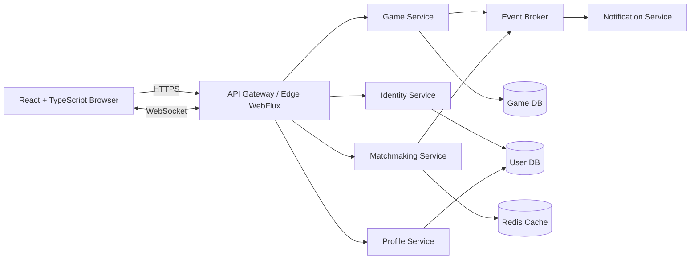

# jchess 프로젝트 아키텍처

## 1. 목적

jchess는 Java 기반의 온라인 체스 게임이다. 교육용 배포를 목표로 하므로 최신 기술을 사용하되, 각 기술의 역할과 선택 이유를 학습자가 이해할 수 있어야 한다.

이 문서는 다음 아키텍처를 기준으로 개발한다.

- Backend: Java 25 이상, Spring Boot 4
- API/실시간 통신: Spring WebFlux, WebSocket
- Frontend: React, TypeScript
- Persistence: JPA/Hibernate 기반 관계형 데이터 저장
- 운영 구조: MSA를 목표로 하되 단계적으로 분리
- 품질: 단위 테스트, 통합 테스트, 계약 테스트, 보안 및 접근성 검증

> Spring Boot 4와 각 라이브러리의 실제 호환 버전은 프로젝트 초기화 시 공식 릴리스 문서와 의존성 BOM으로 최종 확인한다. 이 문서의 `Java 25 이상`은 프로젝트의 최소 Java 버전 정책이다.

## 2. 아키텍처 결정

### ADR-001: Java 25 이상

- 결정: Java 25 이상을 사용한다.
- 이유:
  - 최신 LTS 또는 프로젝트가 정한 최신 기준의 언어 및 JVM 기능을 활용한다.
  - 장기 유지보수와 교육용 최신 Java 학습을 지원한다.
- 제약:
  - 로컬 JDK, CI, Docker 이미지, IDE 설정의 Java 버전을 동일하게 맞춘다.
  - 사용한 언어 기능과 JVM 기능은 문서에 기록한다.

### ADR-002: Spring Boot 4

- 결정: Backend의 기본 프레임워크로 Spring Boot 4를 사용한다.
- 이유:
  - Spring 생태계의 자동 설정, 테스트, 운영 기능을 활용한다.
  - WebFlux, Security, Data, Actuator를 일관된 방식으로 통합할 수 있다.
- 제약:
  - Spring Boot 4가 지원하는 Java 및 Spring Framework 버전을 공식 문서로 확인한다.
  - 호환되지 않는 라이브러리는 무리하게 추가하지 않고 BOM 기준으로 버전을 선택한다.

### ADR-003: WebFlux와 JPA의 경계 분리

- 결정: 외부 API와 실시간 연결은 WebFlux를 사용하고, JPA 접근은 blocking 작업으로 명확히 격리한다.
- 이유:
  - WebFlux는 non-blocking 이벤트 루프를 사용한다.
  - 일반적인 JPA/Hibernate 호출은 blocking JDBC를 사용하므로 이벤트 루드를 직접 막으면 지연과 동시성 문제가 생긴다.
- 구현 원칙:
  - WebFlux의 reactive handler 또는 controller에서 JPA를 직접 호출하지 않는다.
  - JPA 호출은 별도 persistence adapter 또는 blocking service 경계에 둔다.
  - blocking 작업을 실행해야 하는 경우 bounded elastic scheduler 등 명시적인 격리 전략을 사용한다.
  - 게임 수 판정처럼 짧고 빈번한 상태 변경은 DB 트랜잭션과 동시성 제어를 함께 설계한다.
  - 장기적으로 완전한 non-blocking persistence가 필요하면 해당 서비스만 R2DBC로 분리하는 것을 검토한다.

### ADR-004: MSA의 단계적 도입

- 결정: 최종 운영 구조는 서비스별 독립 배포가 가능한 MSA로 설계하되, 초기 교육 단계는 모듈형 모놀리스로 시작한다.
- 이유:
  - 처음부터 여러 저장소, 배포, 네트워크, 관측 시스템을 운영하면 체스 도메인 학습보다 인프라 복잡도가 커진다.
  - 모듈 경계를 먼저 검증한 뒤 트래픽과 변경 주기가 다른 영역만 서비스로 분리할 수 있다.
- 분리 기준:
  - 독립적인 데이터 소유권
  - 독립적인 배포 필요성
  - 명확한 API 또는 이벤트 계약
  - 장애 격리 필요성
  - 실제 확장 요구

## 3. 전체 구성



초기 구현에서는 위 서비스를 하나의 Spring Boot 애플리케이션 안에서 모듈로 나누고, 이후 필요할 때 독립 애플리케이션으로 추출한다.

## 4. Backend 서비스 경계

### 4.1 Edge/API 모듈

책임:

- HTTPS 요청과 WebSocket 연결 수신
- 인증 토큰 검증과 공통 요청 제한
- API DTO 변환
- 서비스 응답 형식 통일
- 연결 종료, 재접속, backpressure 처리

금지:

- 체스 규칙 판정
- 클라이언트가 보낸 승패나 보드 상태 신뢰
- JPA Repository 직접 호출

### 4.2 Game Service

온라인 체스의 핵심 도메인이다.

책임:

- Board, Piece, Move, GameState 관리
- 합법 수 생성 및 검증
- Check, Checkmate, Stalemate, Draw 판정
- Castling, En passant, Promotion 처리
- 수 확정의 원자성 보장
- 게임 시계와 수 번호 검증
- 기보와 게임 결과 저장 요청

규칙 엔진은 WebFlux나 데이터베이스에 종속되지 않는 순수 Java 도메인 코드로 둔다.

### 4.3 Identity/Auth 모듈

책임:

- 회원가입, 로그인, 로그아웃
- 비밀번호 해시 저장
- Access Token과 Refresh Token 정책
- 사용자와 역할 관리
- 게임 참가자 권한 확인

### 4.4 Matchmaking 모듈

책임:

- 게임 요청 등록 및 취소
- 시간 형식과 색상 조건 매칭
- 대기열의 중복 요청 방지
- 매칭 완료 이벤트 발행

### 4.5 Profile/History 모듈

책임:

- 사용자 기본 정보
- 게임 기록 조회
- 기보와 결과 조회
- 전적과 통계

### 4.6 AI Engine / PVC (Player vs Computer) 모듈

책임:

- **하이브리드 엔진 계층 (`ChessAiEngine`)**:
  - `StockfishUciEngineAdapter`: UCI(Universal Chess Interface) 표준 프로토콜을 사용하는 Stockfish 프로세스를 제어하며, ELO 2000 수준 파라미터(`UCI_LimitStrength`, `UCI_Elo`=2000)를 주입
  - `JavaFallbackChessAiEngine`: 외부 바이너리가 없는 CI/로컬 환경 및 비정상 프로세스 오류 시 100% 무중단 동작을 보장하는 순수 Java Minimax / Alpha-Beta Pruning 체스 엔진
- **스레드 및 리소스 격리**: 비동기 전용 스레드 풀(`aiEngineTaskExecutor`)을 통한 논블로킹 수 연산 요청, 5초 타임아웃 강제
- **보안 및 무결성**: OS 셸을 거치지 않는 바이너리 직접 실행 및 FEN/Move 인자 화이트리스트 검증 (Command Injection 차단)
- **도메인 결합**: AI 착수 결과를 도메인 `GameService.playMove()`로 전달하여 낙관적 락 검증 후 WebSocket으로 전체 브로드캐스트 전파

### 4.6 Notification 모듈

책임:

- 게임 시작, 상대 입장, 종료 알림
- 시스템 알림
- 이메일 또는 push 연동을 위한 확장 지점

## 5. 데이터 및 저장 전략

### 기본 원칙

- 각 서비스는 자신의 데이터를 소유한다.
- 다른 서비스의 테이블을 직접 조회하거나 수정하지 않는다.
- 서비스 간 데이터는 API 또는 이벤트로 교환한다.
- 교육 단계에서는 하나의 PostgreSQL 인스턴스 안에 모듈별 schema를 사용할 수 있다.
- 서비스가 분리되면 서비스별 데이터베이스 또는 독립 schema로 이동한다.

### JPA 사용 영역

- 사용자, 게임 메타데이터, 기보, 결과, 통계 등 영속성이 필요한 데이터
- Repository와 Entity는 persistence 모듈에 둔다.
- Domain 객체가 JPA Entity에 직접 의존하지 않도록 매핑 계층을 둔다.
- 트랜잭션 범위를 명확히 하고 낙관적 락 또는 버전 필드로 동시 수 요청을 방어한다.

### 실시간 게임 상태

MVP는 게임 상태 snapshot과 수 기록을 PostgreSQL에 저장하고, 메모리 캐시는 조회 보조로만 사용한다. 재접속은 캐시나 마지막 WebSocket 이벤트에 의존하지 않고 DB snapshot의 `gameVersion`을 기준으로 복구한다.

- 하나의 수 검증, 상태 변경, 수 기록 저장은 하나의 트랜잭션 경계에서 처리한다.
- `gameVersion` 또는 낙관적 락 충돌이 발생하면 상태를 변경하지 않고 충돌 오류를 반환한다.
- Redis 기반 active state는 동시 게임 수와 지연 요구가 확인된 뒤 별도 ADR로 도입한다.
- MVP 완료 조건에는 Redis가 포함되지 않는다.

## 6. 통신 방식

### 외부 API

- 로그인, 게임 생성, 기록 조회 등 요청-응답 작업: HTTPS REST API
- 요청 및 응답 형식: JSON
- 모든 변경 요청에 `requestId`와 `gameVersion` 또는 `moveNumber`를 포함한다.

예시:

```json
{
  "gameId": "game-123",
  "requestId": "request-456",
  "moveNumber": 12,
  "from": "e2",
  "to": "e4",
  "promotion": null
}
```

### WebSocket

- 대국 중 상대 수, 시계, 연결 상태, 게임 종료 이벤트 전달
- 서버가 확정한 이벤트만 클라이언트에 broadcast한다.
- 클라이언트가 보낸 수는 명령으로 취급하고 서버가 검증한다.
- 재접속 시 마지막 이벤트에 의존하지 않고 서버의 현재 `GameState`를 다시 동기화한다.
- 메시지 순서, 중복 이벤트, 연결 종료를 테스트한다.

#### Canonical state

게임 상태와 연결 상태를 분리한다.

```json
{
  "gameStatus": "ACTIVE",
  "turn": "WHITE",
  "pendingPromotion": null,
  "connectionStatus": "CONNECTED",
  "gameVersion": 12
}
```

- `gameStatus`: `WAITING_FOR_OPPONENT`, `ACTIVE`, `CHECK`, `CHECKMATE`, `STALEMATE`, `DRAW`, `RESIGNED`, `TIMEOUT`
- `turn`: `WHITE` 또는 `BLACK`
- `pendingPromotion`: Promotion 선택이 필요한 경우 `{ "color": "WHITE", "from": "e7", "to": "e8" }`, 아니면 `null`
- `connectionStatus`: `CONNECTED`, `RECONNECTING`, `SYNCING`, `DISCONNECTED`
- `gameVersion`: 서버가 확정한 상태의 단조 증가 버전

`YOUR_TURN`, `OPPONENT_TURN`, `PROMOTION_REQUIRED`는 Backend의 canonical game state가 아니라 Frontend가 `gameStatus`, `turn`, `pendingPromotion`을 조합해 표현하는 화면 상태다.

#### Command schema

클라이언트는 다음 명령을 보낼 수 있다. 서버는 명령을 신뢰하지 않고 인증, 권한, 차례, 버전을 검증한다.

```json
{
  "type": "PLAY_MOVE",
  "requestId": "request-456",
  "gameId": "game-123",
  "expectedGameVersion": 12,
  "from": "e2",
  "to": "e4",
  "promotion": null
}
```

```json
{
  "type": "RESIGN",
  "requestId": "request-457",
  "gameId": "game-123",
  "expectedGameVersion": 13
}
```

#### Event envelope

서버가 확정한 모든 상태 변경은 다음 envelope으로 전달한다.

```json
{
  "eventId": "event-789",
  "gameId": "game-123",
  "gameVersion": 13,
  "eventType": "GAME_STATE_UPDATED",
  "occurredAt": "2026-09-08T12:00:00Z",
  "payload": {
    "gameStatus": "ACTIVE",
    "turn": "BLACK",
    "pendingPromotion": null
  }
}
```

필수 event type은 `GAME_STATE_SNAPSHOT`, `GAME_STATE_UPDATED`, `MOVE_REJECTED`, `CONNECTION_SYNC_REQUIRED`, `GAME_ENDED`, `ERROR`다.

#### 오류, 순서와 재시도

- 오류는 `{ "code", "messageKey", "requestId", "gameVersion", "retryable" }` 형식으로 전달한다.
- `gameVersion`은 게임별로 증가하며 클라이언트는 더 낮은 버전의 이벤트를 무시한다.
- 동일한 `requestId`를 다시 보내면 서버는 저장된 원래 결과를 반환하고 수를 다시 적용하지 않는다.
- `expectedGameVersion`이 현재 버전과 다르면 `GAME_VERSION_CONFLICT`를 반환하며 최신 snapshot을 함께 제공한다.
- 연결 재수립 후 클라이언트가 `SYNC`를 요청하면 서버는 최신 전체 snapshot을 먼저 보낸다.
- 게임이 종료된 뒤의 명령은 `GAME_ALREADY_FINISHED`로 거부한다.

### 내부 통신

- 초기 모듈형 모놀리스: 명시적인 Java service interface
- 서비스 분리 후 동기 조회: REST 또는 gRPC 검토
- 상태 변경과 알림: 이벤트 브로커 검토
- 이벤트는 버전, 발생 시각, aggregate ID를 포함한다.

### 게임 시계 정책

- 서버의 monotonic clock과 authoritative timestamp만 승패 판정에 사용한다.
- 클라이언트 시계는 표시용이며 서버에 남은 시간을 제출하지 않는다.
- MVP는 고정 시작 시간과 기본 timeout을 지원하고, Increment는 명시적으로 선택된 게임에서만 적용한다.
- 수 확정 시 서버는 수신 시각, 검증 완료 시각, 확정 버전을 기록한다.
- 수와 timeout이 동시에 경합하면 게임 aggregate에 먼저 원자적으로 확정된 사건 하나만 승리한다.
- 연결이 끊겨도 서버 시계는 계속 흐르며, 재접속 시 서버가 계산한 남은 시간을 snapshot으로 제공한다.
- pause는 MVP에서 지원하지 않는다.

## 7. Frontend 구성

### 기술

- React
- TypeScript
- Vite 기반 개발 서버 및 번들링
- 상태 관리: 서버 상태와 UI 상태를 구분해 선택
- WebSocket client: 연결, 재연결, heartbeat, 메시지 순서 처리

### 주요 영역

- `features/game`: 보드, 기물, 수 선택, Promotion
- `features/matchmaking`: 대국 신청과 매칭
- `features/auth`: 로그인과 세션
- `features/history`: 기보와 전적
- `shared/api`: HTTP client와 API 타입
- `shared/realtime`: WebSocket 연결 관리자
- `shared/ui`: 공통 UI 컴포넌트

### Frontend 원칙

- 서버 상태를 게임의 진실로 사용한다.
- 낙관적 UI를 사용하더라도 서버 확정 전에는 임시 상태로 표시한다.
- WebSocket 재연결 후 전체 상태 동기화를 수행한다.
- 키보드, 터치, 스크린 리더, 색상 대비를 지원한다.
- 수가 거부되면 서버의 오류 코드와 사용자용 설명을 분리한다.

## 8. 보안 및 공정성

- 서버만 합법적인 수와 게임 결과를 확정한다.
- 사용자는 자신의 게임 또는 허용된 관전 게임만 접근한다.
- 클라이언트 시간은 표시용이며 timeout 판정은 서버 시계로 처리한다.
- WebSocket handshake와 모든 명령에 인증 및 권한 검사를 적용한다.
- `gameId`, `moveNumber`, `requestId`를 검증해 다른 게임 조작과 replay 요청을 방지한다.
- 비밀번호, 토큰, 개인정보를 로그에 남기지 않는다.
- 의존성 취약점과 비밀정보 노출을 CI에서 검사한다.
- 상세 보안 기준은 [agent/sm.md](../agent/sm.md)를 따른다.

### MVP 인증 및 권한 정책

- MVP는 짧은 수명의 access token과 서버 측 refresh token 폐기 목록을 사용한다. 정확한 만료 시간과 해시 파라미터는 구현 전에 별도 보안 결정으로 기록한다.
- HTTPS와 WSS만 허용한다.
- WebSocket handshake에서 access token을 검증하고, 각 command에서 게임 참가자 권한을 다시 확인한다.
- CORS는 허용 origin 목록으로 제한하고, 브라우저 기반 인증 흐름에는 CSRF 방어를 적용한다.
- 게임 참가자만 게임 생성, 참가, 수 변경, 기권, 무승부 요청을 할 수 있다.
- 관전자는 MVP에서 제외한다.
- `requestId`는 게임별 최소 게임 수명 동안 저장해 재전송을 방지한다.
- 감사 로그에는 `eventType`, `gameId`, actor ID, 결과 코드, 시각, trace ID만 남기며 토큰과 비밀번호는 남기지 않는다.

### 위협 모델 요약

| 자산 | 경계/공격자 | 주요 위협 | 기본 대응 |
| --- | --- | --- | --- |
| 게임 상태와 결과 | 인증된 사용자, 변조된 클라이언트 | 불법 수, stale/replay 요청 | 서버 규칙 판정, version, requestId |
| 계정과 토큰 | 인터넷, 탈취된 브라우저 | token 탈취, 권한 상승 | HTTPS, 만료/폐기, origin 제한 |
| 개인정보와 기보 | API 사용자, 로그 접근자 | 과도한 조회와 로그 노출 | 최소 수집, 객체 권한, redaction |
| 서비스 가용성 | 자동화 공격자 | WebSocket 폭주, 큰 메시지 | rate limit, payload/연결 제한 |

## 9. 관측성과 운영

- 구조화된 로그에 `traceId`, `gameId`, `userId`를 필요한 범위에서 포함한다.
- 로그에 비밀번호, 토큰, 민감한 개인정보를 포함하지 않는다.
- Actuator 기반 health, readiness, liveness를 제공한다.
- 핵심 지표:
  - 활성 게임 수
  - 수 검증 실패 수
  - WebSocket 연결 및 재연결 수
  - 수 확정 지연 시간
  - 게임 상태 저장 실패 수
  - 매칭 대기 시간
- 분산 서비스로 전환할 때 trace context를 HTTP, WebSocket, 이벤트에 전달한다.

## 10. 개발 단계

### Phase 1: 교육용 모듈형 모놀리스

- Java 25 이상과 Spring Boot 4 프로젝트 초기화
- 순수 Java 체스 규칙 엔진
- REST API와 WebSocket
- PostgreSQL + JPA
- React + TypeScript 보드
- 단위 및 통합 테스트

### Phase 2: 온라인 운영 기능

- 로그인과 권한
- 매칭 대기열
- 재접속 및 게임 복구
- 서버 시계와 timeout
- 관전과 기보 조회
- 관측성과 보안 자동 점검

### Phase 3: 선택적 MSA 분리

- Identity/Auth 분리
- Matchmaking 분리
- Game Service 독립 배포
- Notification 분리
- 서비스별 저장소와 이벤트 브로커 도입

서비스를 분리할 때는 모듈 경계, 데이터 소유권, API 계약, 배포 필요성을 먼저 검증한다.

## 11. 저장소 구조

초기 권장 구조:

```text
jchess/
├─ agent/
├─ docs/
│  ├─ architecture.md
│  └─ chess-game-rules.md
├─ backend/
│  ├─ build.gradle 또는 pom.xml
│  └─ src/
│     ├─ main/java/
│     │  └─ ...
│     └─ test/java/
├─ frontend/
│  ├─ package.json
│  ├─ tsconfig.json
│  └─ src/
├─ infra/
│  ├─ docker/
│  └─ compose.yaml
└─ init_SETUP.md
```

실제 패키지와 의존성은 이 문서의 결정에 따라 프로젝트 초기화 단계에서 추가한다.

## 12. 역할별 승인

- PM: 범위, 우선순위, 릴리스 목표
- TL: 아키텍처, 기술 선택, 코드 구조
- QM: 테스트 전략, 품질 게이트, 릴리스 검증
- SM: 인증, 권한, 데이터 보호, 공정성 위험
- UX: 대국 흐름, 조작, 접근성, 오류 피드백

역할 정의는 다음 문서를 따른다.

- [PM](../agent/pm.md)
- [TL](../agent/tl.md)
- [QM](../agent/qm.md)
- [SM](../agent/sm.md)
- [UX/UDI](../agent/ux.md)

## 13. 후속 결정이 필요한 항목

- Maven과 Gradle 중 빌드 도구
- Spring Boot 4의 정확한 안정 버전
- PostgreSQL 버전
- Redis 도입 시점
- WebSocket 구현 방식과 메시지 프로토콜
- 인증 방식: 세션 또는 JWT
- 배포 환경과 CI 플랫폼
- 관측성 도구와 로그 보존 정책
