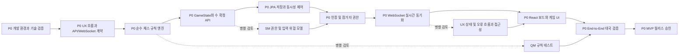

# jchess 프로젝트 진행 계획서

## 1. 문서 목적

이 문서는 PM 관점에서 jchess 온라인 체스 게임의 초기 개발 순서, 우선순위, 주요 산출물, 의존성과 critical path를 정의한다.

대상은 교육용으로 프로젝트를 학습하고 실행할 개발자다. 따라서 일정상 빠른 구현보다 이해 가능한 구조, 재현 가능한 설치, 검증 가능한 결과를 우선한다.

관련 문서:

- [아키텍처](architecture.md)
- [체스 게임 규칙](chess-game-rules.md)
- [온라인 체스 UX 화면 레퍼런스](ux-screen-references.md)
- [초기 설정 기록](../init_SETUP.md)
- [역할 정의: PM](../agent/pm.md)
- [역할 정의: TL](../agent/tl.md)

## 2. 프로젝트 목표

### 2.1 MVP 목표

사용자가 브라우저에서 다른 사용자와 기본 체스 대국을 진행하거나(PVP), ELO 2000 수준의 AI 엔진과 대국(PVC)할 수 있고, 서버가 모든 수와 게임 결과를 검증하며, 연결이 끊겨도 게임 상태를 복구할 수 있는 첫 번째 릴리스를 완성한다.

MVP에 포함한다.

- 초기 체스판과 모든 기물 이동
- Check, Checkmate, Stalemate
- Castling, En passant, Promotion
- 서버 권위형 수 검증
- 두 사용자 간 대국(PVP) 생성 및 참가
- 플레이어 대 컴퓨터(PVC) 대국 및 UCI 체스 엔진(ELO 2000+) 연동
- REST 기반 게임 생성 및 조회
- WebSocket 기반 수와 게임 상태 전달
- React/TypeScript 보드 UI
- 대기, 대국 중, Promotion, Check, 재접속, 종료 상태를 표시하는 UX
- 기본 게임 기록과 결과 저장
- 기본 인증 및 게임 참가자 권한
- 핵심 규칙, API, 재접속 통합 테스트

### 2.2 후속 릴리스

MVP 안정화 후 추가한다.

- 매칭 대기열
- 관전
- 전적 및 통계
- 무승부 제안과 청구 UI
- 다양한 시간 형식과 Increment
- 알림
- 운영자 기능
- 서비스별 독립 배포와 MSA 분리

### 2.3 MVP에서 제외

- Chess960
- 결제 및 유료 기능
- 음성 채팅
- 복잡한 소셜 기능
- 초기 단계의 서비스별 독립 데이터베이스

### 2.4 MVP 게임 종료 정책

MVP에서 자동 또는 즉시 처리한다.

- Checkmate
- Stalemate
- 기권
- 기본 시간 제한 초과
- Dead position을 판정할 수 있는 최소 불충분 기물 상황
- 양쪽 합의 무승부

다음 청구/자동 판정은 규칙 엔진의 포지션 이력 설계가 안정된 뒤 후속 단계로 둔다.

- 3회 반복 무승부 청구
- 50-move rule 청구
- 5회 반복 자동 무승부
- 75-move rule 자동 무승부

## 3. 우선순위 기준

- P0: 없으면 합법적인 온라인 대국이 불가능한 기능
- P1: MVP 사용자 흐름에 필요하지만 대체 경로가 있는 기능
- P2: MVP 이후의 편의 또는 확장 기능

| 우선순위 | 영역 | 기준 |
| --- | --- | --- |
| P0 | 개발 환경과 빌드 | 모든 학습자가 동일하게 빌드하고 테스트할 수 있어야 함 |
| P0 | 규칙 엔진 | 잘못된 수와 잘못된 결과를 서버가 막아야 함 |
| P0 | 게임 상태 | 차례, 상태 버전, 수 기록, 종료 결과를 일관되게 관리해야 함 |
| P0 | 실시간 통신 | 두 클라이언트가 같은 확정 상태를 받아야 함 |
| P0 | 최소 UI | 사용자가 수를 선택하고 결과를 이해할 수 있어야 함 |
| P0 | 테스트와 보안 | 핵심 규칙과 참가자 권한을 자동 검증해야 함 |
| P0 | 인증 최소 구현 | WebSocket과 게임 참가자 권한을 안전하게 운영해야 함 |
| P0 | 재접속 | 연결 복구 후 최신 게임 상태를 복원해야 함 |
| P0 | 기본 시간 제한 | 서버 시계와 timeout을 제공해야 함 |
| P1 | 인증 고도화 | 계정과 세션을 안전하게 운영해야 함 |
| P2 | 매칭, 관전, 통계 | 대국 경험과 운영 확장 기능 |

## 4. 단계별 실행 계획

### Phase 0: 결정 및 개발 환경

목표: 개발자가 프로젝트를 재현할 수 있는 기반을 만든다.

주요 작업:

- JDK 25 이상 설치 및 `JAVA_HOME` 설정
- Maven 또는 Gradle 선택 및 Wrapper 생성
- Spring Boot 4 Backend 초기화
- React + TypeScript + Vite Frontend 초기화
- PostgreSQL 개발 환경 구성
- 테스트, lint, format, CI 명령 확정
- 모든 설치 명령을 `init_SETUP.md`에 기록
- Backend와 Frontend의 API/WebSocket 계약 초안 작성
- WebFlux와 JPA의 blocking 경계에 대한 기술 검증

완료 조건:

- Backend와 Frontend가 각각 로컬에서 실행된다.
- 빈 프로젝트의 빌드와 테스트가 통과한다.
- 새 개발자가 문서만 보고 환경을 재현할 수 있다.

### Phase 0.5: UX 조사 및 기본 화면 기획

목표: 유명 온라인 체스 서비스의 화면 패턴을 참고하되, jchess에 맞는 독자적인 대국 흐름과 상태 표시를 확정한다.

주요 작업:

- Chess.com과 Lichess의 대국, 분석, 매칭, 토너먼트 화면 5종 비교
- UX-01 대상 사용자와 핵심 시나리오 정의
- UX-02 레퍼런스 비교 및 MVP UX 요구사항 추출
- UX-03 정보 구조와 게임 상태 모델 설계
- UX-04 데스크톱/모바일 저해상도 와이어프레임 작성
- UX-05 화면 상태를 REST/WebSocket 계약에 매핑
- UX-06 키보드, 터치, 스크린 리더, 색상 대비 검토
- UX-07 최소 3명 대상 사용성 테스트 계획 수립
- UX-08 개발 인수 기준과 화면 회귀 체크리스트 작성

완료 조건:

- 기본 대국 화면의 정보 우선순위가 문서화되었다.
- `MATCHING`부터 `CHECKMATE`, `DRAW`, `RECONNECTING`까지 화면 상태가 정의되었다.
- Backend 이벤트와 Frontend 화면 상태의 매핑표가 승인되었다.
- 기존 서비스 화면을 복제하지 않는 독자적인 디자인 방향이 확정되었다.

TL/PM 검토 기준:

- UX 상태 이름은 `GameState`의 서버 상태 또는 클라이언트 연결 상태 중 어느 것인지 구분한다.
- `CHECK`, `PROMOTION_REQUIRED` 등 게임 규칙 상태와 `RECONNECTING` 등 연결 상태를 하나의 문자열로 뭉치지 않는다.
- 보드, 시계, 기보, 오류 메시지의 상태는 서버가 확정한 이벤트와 일관되게 갱신한다.
- 와이어프레임은 데스크톱과 모바일의 최소 지원 크기, 포커스 이동, 터치 입력을 포함한다.

### Phase 1: 체스 도메인과 규칙 엔진

목표: 네트워크나 DB 없이도 완전히 검증 가능한 체스 핵심을 만든다.

주요 작업:

- `Color`, `PieceType`, `Position`, `Piece`, `Move`, `Board`, `GameState` 모델
- 초기 배치와 차례 관리
- 기물별 후보 수 생성
- 자신의 King을 노출시키는 수 제거
- Check, Checkmate, Stalemate 판정
- Castling, En passant, Promotion
- 수 기록과 포지션 반복 카운트

완료 조건:

- [docs/chess-game-rules.md](chess-game-rules.md)의 핵심 규칙이 테스트로 검증된다.
- 랜덤하거나 잘못된 입력이 보드 상태를 오염시키지 않는다.
- 규칙 엔진이 WebFlux, JPA, HTTP에 의존하지 않는다.
- Castling-through-check, En passant 만료, Promotion with check, Stalemate, dead position의 고정 position fixture가 있다.
- 주요 초기 포지션의 perft 또는 신뢰 가능한 reference-position 결과와 불변식 테스트가 있다.

### Phase 2: Game Service와 저장

목표: 검증된 규칙 엔진을 서버의 단일 게임 상태 흐름에 연결한다.

주요 작업:

- 게임 생성, 참가, 조회 API
- 수 요청 DTO와 오류 코드
- 서버 권위형 수 확정
- `gameId`, `moveNumber`, `requestId` 검증
- JPA Entity와 Domain 매핑
- 트랜잭션과 낙관적 락 또는 버전 필드
- 인증 최소 구현과 게임 참가자 권한 검사
- MVP 인증 정책에 따른 로그인, 토큰 폐기, WebSocket 인증
- 기보와 게임 결과 저장

완료 조건:

- 클라이언트가 보드나 결과를 조작해도 서버가 거부한다.
- 동시에 들어온 두 수 중 하나만 정상 확정된다.
- 저장 실패 시 게임 상태가 부분적으로 변경되지 않는다.
- 인증된 참가자만 게임을 생성, 참가, 수 변경할 수 있다.
- 서버 시계 기준으로 timeout이 판정되고, 동시 수/시간 만료 경합의 결과가 재현된다.
- fake clock으로 timeout, disconnect, reconnect, increment와 수/timeout 경합을 재현할 수 있다.

### Phase 3: WebSocket 실시간 대국

목표: 두 클라이언트가 서버가 확정한 게임 상태를 실시간으로 공유한다.

주요 작업:

- WebSocket handshake 인증과 게임 참가자 권한 확인
- 게임별 연결 및 권한 관리
- 수 확정, 상태 동기화, 종료 이벤트
- heartbeat, 연결 종료, 재연결
- 재접속 시 전체 `GameState` 재전송
- WebFlux 이벤트 루프와 JPA blocking 구간 검증

완료 조건:

- 수를 둔 사용자와 상대 사용자가 같은 서버 확정 상태를 본다.
- 중복 이벤트와 중복 요청이 게임 상태를 중복 변경하지 않는다.
- 재접속 후 수, 차례, 종료 상태가 복구된다.

### Phase 4: React/TypeScript 사용자 경험 및 대국 인터페이스

목표: 초보자도 게임 상태와 조작 방법을 이해할 수 있고, 사람(PVP) 및 AI(PVC) 대국을 원활히 진행할 수 있는 화면을 제공한다.

주요 작업:

- 체스판 및 좌표 표시
- 기물 선택과 합법적인 목적지 표시
- Promotion 선택 UI
- 현재 차례, Check, 마지막 수, 게임 종료 표시
- PVP / PVC (AI 대전) 선택 및 AI 난이도(ELO 2000+) 대국 진입 UI
- AI 턴 시 "AI 연산 중..." 인디케이터 및 비동기 상태 반응
- WebSocket 상태 및 재접속 표시
- 오류 메시지와 재시도 흐름
- 키보드, 터치, 색상 대비, 스크린 리더 지원

완료 조건:

- 사용자가 UI에서 PVP 및 PVC 대국을 정상 완료할 수 있다.
- 서버 거부 사유가 이해 가능한 메시지로 표시된다.
- 모바일 및 데스크톱에서 주요 정보가 겹치지 않는다.
- 서버 확정 전 수, 확정된 수, 거부된 수를 시각적으로 구분한다.
- `RECONNECTING` 후 전체 `GameState`를 받아 화면이 복구된다.
- 키보드만으로 핵심 대국 흐름을 수행하고 포커스 위치를 확인할 수 있다.
- 기본 색상 조합이 색상 대비 기준을 충족하고 색상 외 상태 표현을 제공한다.

### Phase 4.5: UCI AI 엔진 연동 및 비동기 수 처리 (PVC Engine)

목표: 외부 UCI 엔진(Stockfish 등)을 비동기 스레드 풀로 연동하여 ELO 2000+ 급 PVC 대국을 지원한다.

주요 작업:

- UCI 프로토콜 어댑터 (`UciEngineAdapter`) 구현
- 프로세스 수명 주기 및 I/O 스트림 관리 (Stockfish 바이너리 연동)
- ELO 2000 수준 설정 (`UCI_LimitStrength`, `UCI_Elo`=2000 또는 Depth 설정)
- 플레이어 착수 완료 후 비동기 스케줄러를 통한 AI 자동 착수 트리거
- AI 착수 완료 시 `GameService` 및 WebSocket 브로드캐스트 파이프라인 연동
- 엔진 크래시 및 Timeout 시 Fail-Safe 복구/에러 핸들링

완료 조건:

- 플레이어가 수를 두면 비동기 스레드에서 AI가 2000 ELO 수준의 합법적 수를 생성하여 응답한다.
- AI 연산 중 메인 웹/웹소켓 스레드가 블로킹되지 않는다.
- AI 엔진의 비정상 종료 시에도 대국 세션이 안전하게 유지되고 복구된다.

### Phase 5: 인증, 시간, 운영 품질

목표: 온라인 서비스로서의 최소 운영 안전성을 확보한다.

주요 작업:

- 인증 정책 고도화 및 토큰 폐기/회전
- 관전자 권한 분리와 인증 정책 고도화
- 서버 시계, timeout, 기본 시간 형식의 운영 검증
- 입력 속도 제한과 감사 로그
- 구조화 로그와 Actuator health check
- 보안 의존성 및 비밀정보 검사
- 부하 및 장애 복구 테스트

완료 조건:

- 다른 사용자의 게임을 조회하거나 조작할 수 없다.
- 클라이언트 시계 조작으로 승패를 바꿀 수 없다.
- 치명적 보안 이슈와 P0 결함이 없다.

### Phase 6: 후속 기능 및 MSA 분리

목표: 실제 사용량과 변경 주기에 따라 필요한 서비스만 독립 배포한다.

주요 작업:

- Matchmaking 분리
- Identity/Auth 분리
- Notification 분리
- 이벤트 브로커와 서비스 간 계약
- 서비스별 데이터 소유권
- 분산 tracing과 장애 격리

진입 조건:

- 모듈 경계와 API 계약이 안정적이다.
- 독립 배포의 운영상 이점이 확인된다.
- 서비스 분리 비용과 장애 대응 능력이 준비되어 있다.

## 4.1 TL/PM의 UX-아키텍처 검토 결과

UX 문서를 검토한 결과 다음 항목을 프로젝트 계획의 기술 및 제품 기준으로 확정한다.

### 상태 계약

- 서버 게임 상태와 클라이언트 연결/UI 상태를 별도 필드로 관리한다.
- 서버 게임 상태의 최소 집합은 `WAITING_FOR_OPPONENT`, `ACTIVE`, `CHECK`, `CHECKMATE`, `STALEMATE`, `DRAW`, `RESIGNED`, `TIMEOUT`으로 정의한다.
- 연결 상태의 최소 집합은 `CONNECTED`, `RECONNECTING`, `SYNCING`, `DISCONNECTED`로 정의한다.
- Promotion은 게임 종료 상태가 아니라 현재 수를 완료하기 위한 `pendingPromotion` 정보로 전달한다.
- WebSocket 이벤트는 `eventId`, `gameId`, `gameVersion`, `eventType`, `occurredAt`, `payload`를 포함한다.
- 재접속 시 이벤트를 이어 붙이는 대신 서버가 현재 전체 상태와 버전을 제공한다.

### Frontend 아키텍처 기준

- 서버 상태와 UI 입력 상태를 분리한다.
- 서버 확정 전 수는 임시 표시만 하며, 확정 이벤트가 오면 정식 상태로 반영한다.
- 서버 오류 코드는 사용자 문구와 분리해 관리한다.
- 보드 컴포넌트는 WebSocket 연결 구현이나 JPA 모델을 직접 알지 않는다.
- 화면 상태 전환은 이벤트 매핑과 테스트 가능한 상태 reducer 또는 동등한 명시적 모델을 통해 관리한다.

### PM 범위 결정

- MVP에는 대국 화면의 핵심 상태, 재접속 안내, Promotion 선택, 접근 가능한 기본 조작을 포함한다.
- Game Review의 엔진 평가, 토너먼트, 커뮤니티 기능은 UX 레퍼런스에서 참고하되 MVP 범위에는 넣지 않는다.
- 타 서비스의 시각 디자인, 로고, 아이콘, 문구를 복제하지 않는다.
- UX-07 사용성 테스트는 대국 최소 흐름이 동작한 뒤 진행하며, 발견된 P0 문제는 MVP 출시를 차단한다.

### MVP 기능 소유 단계

| 기능 | 우선순위 | 주 소유 단계 | 비고 |
| --- | --- | --- | --- |
| 체스 규칙과 게임 상태 | P0 | Phase 1~2 | 순수 규칙 엔진과 서버 상태를 분리 |
| 인증 및 참가자 권한 | P0 | Phase 2 | MVP 최소 정책을 구현하고 Phase 5에서 고도화 |
| WebSocket 실시간 대국 | P0 | Phase 3 | 인증된 연결만 허용 |
| 재접속 및 전체 상태 복구 | P0 | Phase 3 | DB-backed snapshot 기준 |
| 기본 시간 제한과 timeout | P0 | Phase 3 | fake clock 테스트 포함 |
| 기본 대국 UI 및 접근성 | P0 | Phase 4 | WCAG 2.2 AA 목표 |
| 관전자, 토너먼트, 커뮤니티 | P2 | Phase 6 | MVP에서 제외 |

## 4.2 TL 기술 검토 기준

Phase를 완료하기 전에 TL은 다음 항목을 확인하고 결정 사항을 문서화한다.

### 실행 모델

- WebFlux controller/handler에서 JPA Repository를 직접 호출하지 않는다.
- JPA 호출은 명시적인 blocking adapter 경계에서 실행한다.
- blocking 호출이 이벤트 루프를 막지 않는지 통합 테스트 또는 측정으로 확인한다.

### 상태 변경과 동시성

- `GameState`의 현재 버전과 `moveNumber`를 저장하고 변경한다.
- 동일한 버전의 수가 동시에 도착하면 하나만 성공하고 나머지는 명확한 충돌 오류를 반환한다.
- 수 검증, 상태 변경, 기보 저장은 하나의 일관된 트랜잭션 경계에서 처리한다.
- 재시도 가능한 요청과 재시도하면 안 되는 요청을 구분한다.

### 계약 우선 개발

- REST DTO, 오류 코드, WebSocket command/event schema를 먼저 고정한다.
- UX 상태-서버 이벤트 매핑표와 WebSocket event envelope을 API 계약의 일부로 취급한다.
- Backend와 Frontend가 공유하는 타입 또는 계약 테스트 전략을 정한다.
- 계약 변경 시 버전, 하위 호환성, 마이그레이션 방법을 기록한다.

### 완료 증거

- 모든 기술 결정에는 실행 가능한 테스트 또는 측정 결과가 있어야 한다.
- 단순히 애플리케이션이 실행되는 것만으로 Phase 완료로 판단하지 않는다.
- 교육용 문서에는 선택한 방식과 선택하지 않은 대안의 이유를 남긴다.

## 5. Critical Path

Critical path는 지연되면 MVP 전체 일정이 지연되는 작업들의 연속이다.

### Critical Path 작업 목록

| ID | 작업 | 선행 작업 | 담당 | 완료 기준 |
| --- | --- | --- | --- | --- |
| CP-01 | JDK, 빌드 도구, Backend/Frontend 초기화와 기술 검증 | 없음 | TL, PM | 로컬 빌드, 테스트, blocking 경계 검증 |
| CP-02 | UX 흐름, 상태 모델, REST/WebSocket 계약과 오류 모델 | CP-01 | TL, UX, QM | 상태표, 와이어프레임, event envelope, DTO, error schema 승인 |
| CP-03 | 순수 Java 체스 규칙 엔진 | CP-02 | TL, QM | 핵심 규칙 테스트 통과 |
| CP-04 | GameState와 서버 수 명령 | CP-03 | TL | 합법 수만 상태에 반영 |
| CP-05 | JPA 저장과 동시성 제어 | CP-04 | TL, SM | 버전 충돌, 중복 수, 저장 실패 검증 |
| CP-06 | 인증 최소 구현과 참가자 권한 | CP-05 | SM, TL | 인증된 참가자만 변경 가능 |
| CP-07 | WebSocket 실시간 동기화 | CP-06 | TL, SM | 두 클라이언트 상태 일치 |
| CP-08 | React 보드와 서버 상태 연결 | CP-02, CP-07 이벤트 계약 | UX, TL | 정상 대국, 재접속, Promotion 및 접근성 흐름 완료 |
| CP-09 | End-to-End 및 회귀 검증 | CP-03~CP-08 | QM | 핵심 사용자 흐름 통과 |
| CP-10 | MVP 승인 및 교육용 문서 갱신 | CP-09 | PM, 전 역할 | 릴리스 체크리스트 완료 |

### Critical Path 관리 규칙

- CP 작업은 P0로 취급하고 일반 기능보다 먼저 처리한다.
- CP 작업의 API, 데이터 모델, 이벤트 계약 변경은 TL과 QM이 함께 검토한다.
- 보안 차단 이슈는 일정과 무관하게 해결할 때까지 다음 CP 단계로 넘기지 않는다.
- CP가 막히면 P1/P2 작업을 추가해 진행률을 부풀리지 않고 blocker를 기록한다.
- 각 단계 종료 시 실행 가능한 테스트 결과와 문서 링크를 남긴다.

## 6. 역할별 책임과 협업

| 영역 | PM | TL | QM | SM | UX/UDI |
| --- | --- | --- | --- | --- | --- |
| 범위와 우선순위 | A/R | C | C | C | C |
| 아키텍처와 기술 | C | A/R | C | C | C |
| 규칙 엔진 품질 | C | R | A/R | C | C |
| 인증과 공정성 | C | R | C | A/R | C |
| 대국 UX | A | C | C | C | A/R |
| 릴리스 승인 | A/R | C | R | R | C |

`A`: 최종 책임, `R`: 실행 책임, `C`: 협의 및 검토

## 7. 위험과 대응

| 위험 | 영향 | 대응 | 소유자 |
| --- | --- | --- | --- |
| WebFlux 이벤트 루프에서 JPA blocking 발생 | 실시간 지연과 장애 | persistence 경계와 blocking scheduler 격리, 부하 테스트 | TL |
| 규칙 엔진 결함 | 게임 결과 오류 | 순수 도메인 테스트, 회귀 테스트, 알려진 기보 시나리오 | QM |
| 클라이언트 조작 | 치팅과 결과 위조 | 서버 권위형 판정, 입력 검증, 권한 검사 | SM, TL |
| MSA 조기 도입 | 교육 난이도와 운영 비용 증가 | 모듈형 모놀리스 우선, 분리 진입 조건 적용 | PM, TL |
| WebSocket 재접속 불일치 | 게임 상태 유실 | 전체 상태 재동기화와 버전 검증 | TL, QM |
| 설치 환경 차이 | 학습자 실행 실패 | Wrapper, 고정 버전, `init_SETUP.md` 기록 | PM, TL |
| 접근성 부족 | 사용자 범위 축소 | 키보드/터치/스크린 리더 테스트를 MVP 게이트에 포함 | UX, QM |
| 서버 상태와 UI 상태 불일치 | 잘못된 보드/시계/결과 표시 | 상태와 연결 상태를 분리하고 event envelope, 전체 재동기화, 계약 테스트 적용 | TL, UX, QM |
| 낙관적 UI와 서버 거부 수 충돌 | 사용자가 유효하지 않은 수를 확정으로 오해 | 임시 수와 확정 수를 구분하고 거부 시 서버 상태로 복원 | TL, UX |
| 화면 복잡도 증가 | 초보자의 핵심 대국 흐름 이탈 | MVP는 핵심 상태만 노출하고 분석/토너먼트/커뮤니티는 후속 릴리스로 제한 | PM, UX |

## 8. 릴리스 게이트

MVP는 다음 조건을 모두 만족해야 한다.

- [ ] `init_SETUP.md`만 보고 개발 환경을 설치할 수 있다.
- [ ] Backend와 Frontend 빌드 및 테스트가 성공한다.
- [ ] 핵심 체스 규칙 테스트가 성공한다.
- [ ] 서버가 불법 수, 잘못된 차례, 다른 게임의 요청을 거부한다.
- [ ] 동시 수 요청과 중복 요청이 안전하게 처리된다.
- [ ] WebSocket 연결, 재연결, 전체 상태 복구가 검증된다.
- [ ] 사용자가 브라우저에서 대국을 시작하고 종료할 수 있다.
- [ ] Checkmate, Stalemate, Draw 상태가 구분되어 표시된다.
- [ ] 인증과 참가자 권한 검증이 완료된다.
- [ ] 서버 시계, timeout, 동시 수/시간 경합 테스트가 통과한다.
- [ ] QM의 P0/P1 결함이 해결되거나 PM이 명시적으로 승인했다.
- [ ] SM의 출시 차단 보안 이슈가 없다.
- [ ] UX의 핵심 접근성 검토가 완료된다.
- [ ] 교육용 README와 실행 예제가 최신 상태다.
- [ ] UX 레퍼런스 조사, 와이어프레임, 사용성 검토 결과가 문서화되어 있다.
- [ ] UX 상태와 WebSocket event envelope 계약 테스트가 통과한다.
- [ ] 임시 수, 서버 확정 수, 거부 수의 화면 동작이 검증된다.
- [ ] WCAG 2.2 AA 기준의 키보드 핵심 흐름, 포커스, live announcement, 색상 대비 검토가 완료된다.
- [ ] 지원 브라우저 최신 2개 버전과 최소 360 x 640 viewport에서 모바일 레이아웃이 검증된다.
- [ ] 최소 터치 영역 44 x 44 CSS px와 reduced-motion 동작이 검증된다.

## 9. 현재 다음 작업

1. PM: CP-01의 Java 배포판, 빌드 도구, Spring Boot 4 안정 버전을 확정한다.
2. TL: Backend와 Frontend의 초기 디렉터리 및 빌드 파일을 생성한다.
3. QM: 규칙 엔진 테스트 케이스 목록을 먼저 작성한다.
4. SM: 인증 전 단계의 위협 모델과 서버 권위형 검증 체크리스트를 작성한다.
5. UX: 대국 시작부터 종료까지의 화면 상태 목록을 작성한다.
6. UX: [ux-screen-references.md](ux-screen-references.md)의 UX-01~UX-04를 진행한다.
7. 모든 설치 명령과 버전은 `init_SETUP.md`에 즉시 기록한다.

## 11. PM 최종 검토 상태

역할별 검토 의견은 반영했으나, 아직 구현과 설치가 시작되지 않았으므로 최종 릴리스 승인은 보류한다.

### 승인된 계획 기준

- PM: MVP 범위, 단계별 소유권, P0/P1/P2 우선순위 승인
- TL: canonical state, 계약 우선 개발, WebFlux/JPA 경계, 동시성 검증 기준 승인
- QM: 규칙/계약/동시성/시계/재접속 테스트를 릴리스 증거로 요구
- SM: 인증, 권한, replay 방지, 개인정보와 운영 보안 기준을 출시 차단 조건으로 요구
- UX: WCAG 2.2 AA, 키보드/스크린 리더, live announcement, 반응형 기준을 MVP 조건으로 요구

### 최종 승인 보류 조건

- [ ] `init_SETUP.md`에 실제 Java, Spring Boot, 빌드 도구, Node, Frontend, DB 버전과 검증 결과 기록
- [ ] canonical state와 REST/WebSocket schema 승인
- [ ] 인증/권한/토큰 정책과 위협 모델 승인
- [ ] 규칙 fixture, perft/invariant, 동시성, fake clock, 재접속, 계약 테스트 구현 및 통과
- [ ] UX 와이어프레임과 오류/상태 문구 카탈로그 승인
- [ ] 릴리스 게이트별 실행 증거, 담당자, 결과 기록

## 12. 변경 이력

| 날짜 | 내용 |
| --- | --- |
| 2026-09-08 | PM 프로젝트 계획서 작성, MVP 범위와 critical path 정의 |
| 2026-09-08 | TL 검토 반영, 계약 우선 개발, WebFlux/JPA 경계, 동시성 기준, 인증 선행 및 critical path 보완 |
| 2026-09-08 | UX 레퍼런스 조사와 UX-01~UX-08 기획 단계를 Phase 0.5 및 Critical Path에 추가 |
| 2026-09-08 | TL/PM 검토 반영, UX 상태 계약, WebSocket event envelope, Frontend 상태 분리 및 접근성 품질 게이트 추가 |
